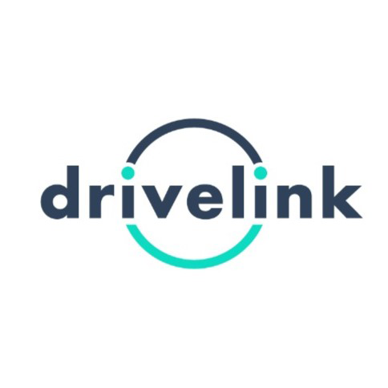

<h2 align='center'>DriveLink</h2>

Sistema proposto para o <b>Challenge BRQ da FIAP 2023</b> visando simplificar o processo de locação de veículos, oferecendo uma plataforma digital para conectar proprietários de veículos leves e pesados a empresas e pessoas interessados em alugar esses veículos.

 

> ⚠️ Para clonar o repositório você precisará do [Git LFS](https://git-lfs.com)

 

---

 

# Criadores

## Adriano Lombardi

 

## Alberto Frigatto de Andrade Ferreira

albertofrigatto.comercial@gmail.com

[Linkedin](https://www.linkedin.com/in/alberto-frigatto-de-andrade-ferreira-a72022251/)

[GitHub](https://github.com/Alberto-Frigatto)

 

## Danilo Fernando de Paula e Silva

 

## Gustavo Rodrigues Lopes

 

## Renato Luís Souza Brandão Júnior